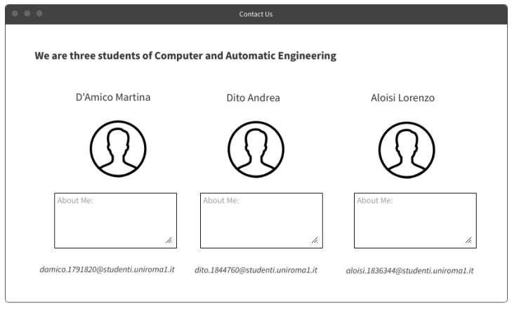

>*Laboratorio di applicazioni software e sicurezza informatica  (Prof: Beraldi Roberto, Console Marco) 
>Aloisi Lorenzo: 1836344,  D'Amico Martina: 1791820,  Dito Andrea: 1844760*

<h1>GreenNetwork </h1>
# Indice
1. [Documentazione Progetto](#documentazioneProgetto)
2. [MockUps](#MockUps)

# Documentazione progetto
GreenNetwork è un’applicazione social/forum che mette a disposizione dei suoi utenti uno spazio in cui pubblicare:
* contenuti informativi/consigli atti alla salvaguardia dell’ambiente;
* foto di avvistamenti di specie botaniche e animali in pericolo di estinzione;
* richieste di collaborazione aventi come fine la pulizia di strade e spazi naturali in condizioni di degrado

L’applicazione consente quindi di accedere ai suddetti contenuti e poterli commentare, 

## Ruoli e funzionalità
* **Amministratore**: ha accesso a tutte le funzionalità dell’applicazione, oltre alla possibilità di bannare gli utenti del sito, o addirittura rimuovere i loro profili. 
* **Utente registrato**: ha la possibilità di visualizzare, creare e commentare posts, previa registrazione e accesso all’applicazione. 
* **Utente non registrato**: possiede il permesso di visualizzare i post e di registrarsi all’applicazione per diventare un utente registrato. 

## Modalità di accesso
* **Accesso locale**: l’utente accede utilizzando nome utente e password, precedentemente inseriti nel database previa registrazione.
* **Accesso tramite Facebook**: l’utente accede all’applicazione utilizzando la connessione alla API di Facebook.

## Descrizione dei dati gestiti: 
Il sito gestisce le seguenti entità:
Post: il post creato dall’utente. Viene salvato il titolo, la descrizione, e l’immagine correlata al post. 

## Mockups

