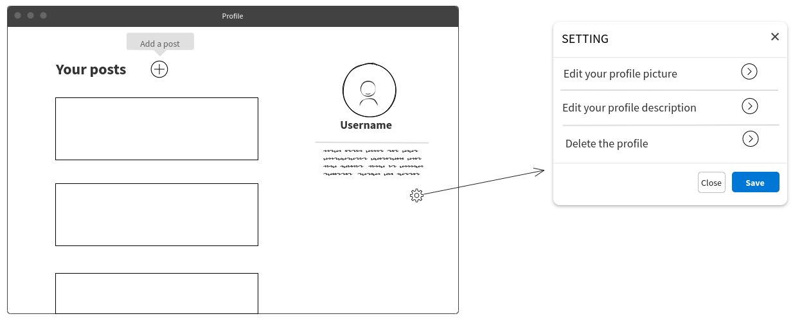
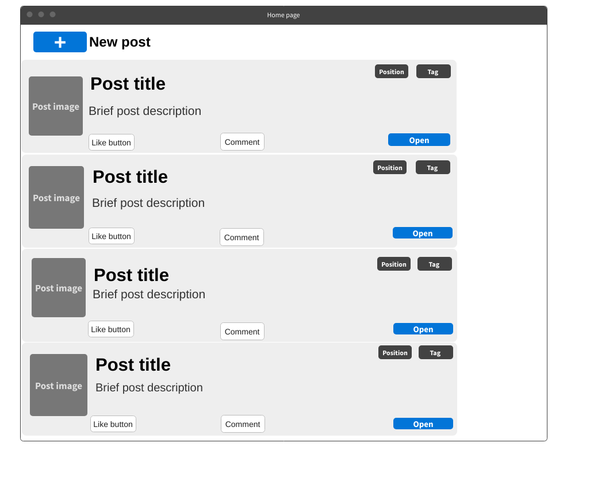

>*Laboratorio di applicazioni software e sicurezza informatica  (Prof: Beraldi Roberto, Console Marco) 
>Aloisi Lorenzo: 1836344,  D'Amico Martina: 1791820,  Dito Andrea: 1844760*

<h1>GreenNetwork </h1>

### Indice
- **[Documentazione progetto](#documentazione-progetto)**
  - **[Rouli e funzionalità](#ruoli-e-funzionalità)**
  - **[Modalità di accesso](#modalità-di-accesso)**
  - **[Dati gestiti](#dati-gestiti)**
- **[Mockups](#mockups)**
  <!--- - **[Login](#login)**
  - **[Registrazione](#registrazione)**
  - **[NavBar](#navbar)**
  - **[Post](#post)**
  - **[Profilo](#profilo)**
  - **[ContactUs](#contactus)**
  - **[Amministrazione](#amministrazione)**
  - **[Home](#home)**
  - **[Post Form](#post-form)**)--->
- **[User Stories](#user-stories)**
  

## Documentazione progetto
GreenNetwork è un’applicazione social/forum che mette a disposizione dei suoi utenti uno spazio in cui pubblicare:
* contenuti informativi o consigli atti alla salvaguardia dell’ambiente, con annessa foto (se presente):  ad esempio foto di avvistamenti di specie botaniche o animali in via di estinzione;
* post atti alla creazione di eventi: ad esempio richieste di collaborazione aventi come fine la pulizia di spazi naturali in condizioni di degrado, oppure denunce di abusi e vandalismi, laddove intacchino la flora o fauna del luogo;

L’applicazione consente di accedere ai suddetti contenuti, potendo quindi visualizzarli ed interagire con essi tramite l’utilizzo di commenti.

## Ruoli e funzionalità
|Ruolo|Privilegi|
|-------|-------|
|Amministratore|Ha accesso a tutte le funzionalità dell’applicazione, oltre alla possibilità di bannare gli utenti del sito, o addirittura rimuovere i loro profili|
|Utente registrato| Ha la possibilità di visualizzare, creare e commentare posts, previa registrazione e accesso all’applicazione.|
|Utente non registrato| Possiede il permesso di visualizzare i post e di registrarsi all’applicazione per diventare un utente registrato.|

## Modalità di accesso
* **Accesso locale**: l’utente accede utilizzando nome utente e password, precedentemente inseriti nel database previa registrazione.
* **Accesso tramite Facebook**: l’utente accede all’applicazione utilizzando la connessione alla API di Facebook.

## Dati gestiti
### Entità Utente
|Dato|Tipo|Descrizione|
|-------|-------|---------|
|Username|String|nome scelto dall'utente|
|Email|String|email dell'utente|
|Password|String|password scelta dall'utente|
|Città|String|Luogo in cui risiede l'utente|
|id|int|identificativo dell'utente|

### Entità Post
|Dato|Tipo|Descrizione|
|-------|-------|---------|
|Titolo|String|Dà una descrizione generale del post creato dall’utente|
|Testo|String|Contenuto del post |
|idUser|String|identificativo dell’utente che ha creato il post|
|Immagine|Blob(?)|Correlata al post stesso, può essere presente o meno|
|Tag|String|Definisce la tipologia del post|
|DataOra|timestamp|data e ora della creazione del post|
|Like|Int|Numero di like che ha ricevuto il post|

### Entità Commento
|Dato|Tipo|Descrizione|
|-------|-------|---------|
|idUser|String|identificativo dell’utente che ha creato il post|
|Testo|String|Contenuto del commento|
|DataOra|timestamp|data e ora della creazione del commento|

## Mockups
### Login

### Registrazione

### NavBar

### Post

### Profilo

### ContactUs

### Amministrazione

### Home

### Post Form

## User Stories

### Unregistered User
1. As an Unregistered User I want to be able to sign-up using my email, to become a Registered User.
2. As an Unregistered User I want to be able to sign-up using Facebook, to become a Registered User.
3. As an Unregistered User I want to be able to see all the posts in the application. 
4. As an Unregistered User I want to have a page in which I can get informations on how to contact the application developers.

### Registered User
